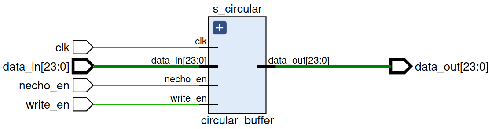
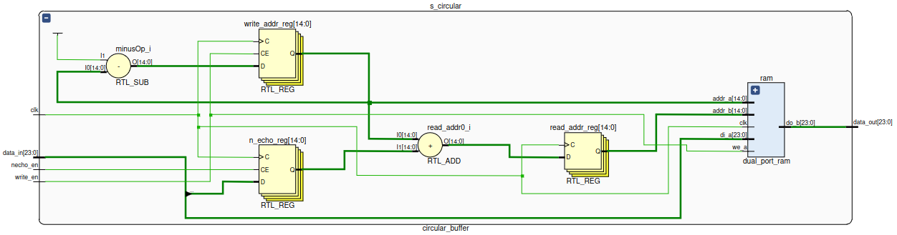
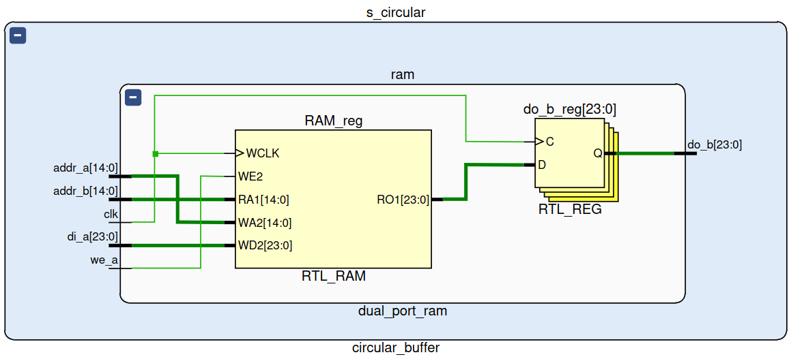

# Circular Buffer for Audio Echo Effect

This project implements a circular buffer for generating an audio echo effect using Verilog HDL in Vivado and Vitis. The circular buffer is instantiated in the `s_circular_buffer` module and consists of a RAM block, one read register, one write register, and an input data register. The RAM block has an address width of 15 bits, a data width of 24 bits, and a depth of 32768.

## Project Files Included
- `circular_buffer.vhd, dual_port_ram.vhd`: VHDL codes for the dual-port RAM used in the circular buffer.
- `hello_world.c`: Vitis project where the circular buffer is instantiated in C code.
- `circular_buffer.xsa`: Vitis hardware platform file for the circular buffer.
- `mixer.txt`: Text file containing data for a signal generated in Matlab.
- `tb_circular_buffer`: Testbench for the circular buffer.
- `wrapper.v`: Top-level module for the circular buffer.

## Inputs and Outputs
- `clk`: Clock signal.
- `data_in`: Input data signal of 24 bits.
- `necho_en`: Enable signal for the echo effect.
- `write_en`: Enable signal for writing to the buffer.
- `data_out`: Output data signal of 24 bits.

## RAM Block
The RAM block in the circular buffer has the following parameters:

- `DATA_WIDTH`: the width of the data bus, which is set to 24 bits.
- `ADDR_WIDTH`: the width of the address bus, which is set to 15 bits.
- `c_buffer`: the depth of the RAM block, which is set to 32768.

The RAM block is shown below:

The RAM block has two sets of inputs and outputs: (`a` and `b` ports). The signals for the `a` port are `di_a`, `addr_a`, and `we_a`. The `b` port signals include `do_b` and `addr_b`.

Please refer to the `LICENSE` file for licensing information.
