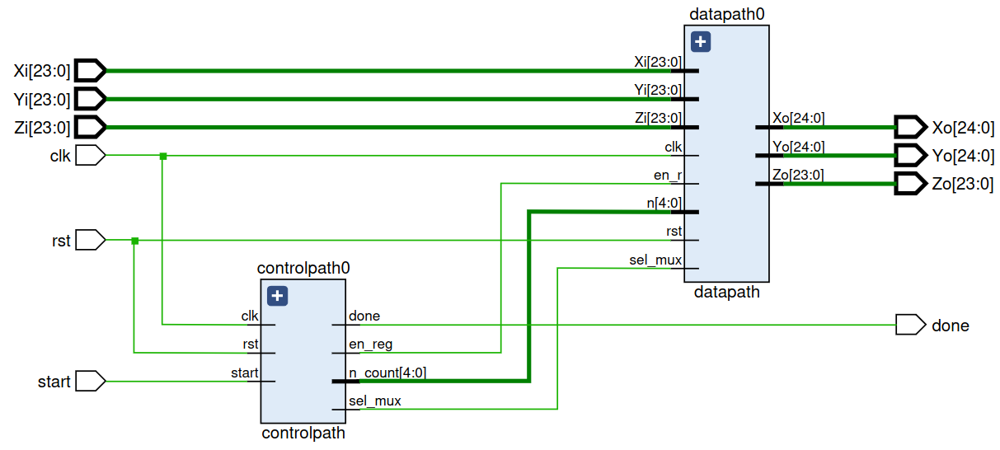
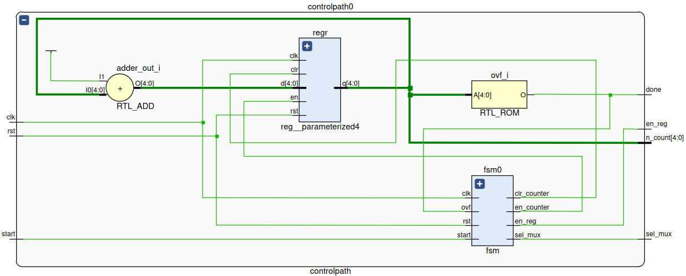
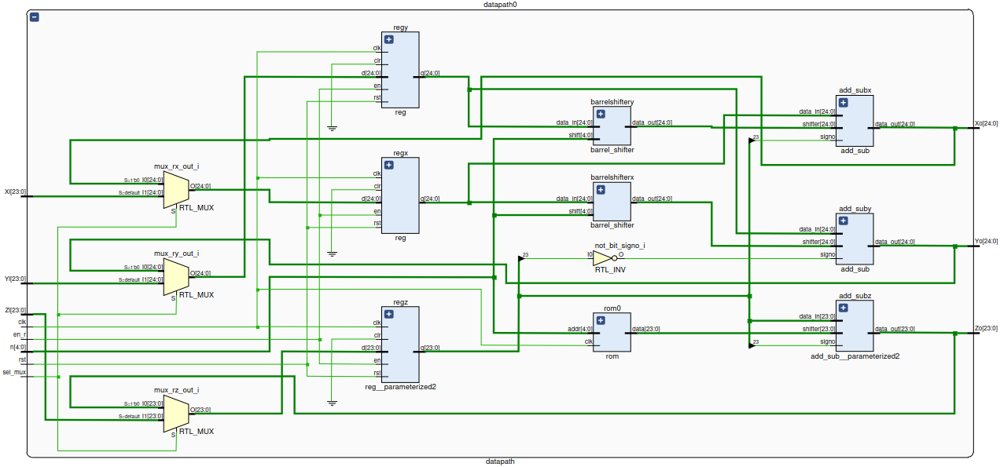

# Cordic Rotation

The controlpath is instantiated in the `controlpath.vhd` module, while the datapath is instantiated in the `datapath.vhd` module. The `cordic_rotation.vhd` module instantiates both the control and datapath modules and includes the Cordic Rotation algorithm. 

In this project, we present the Cordic Rotation, which is used for frequency shifting of incoming data. The design includes the following files:

## Controlpath
- `fsm.vhd`: the state machine of the system.
- `register.vhd`: register module used in the controlpath.

The `controlpath` module is shown below:

## Datapath
- `add_sub.vhd`: module for performing additions or subtractions in the Cordic algorithm.
- `barrel_shifter.vhd`: module for shifting the data in the Cordic algorithm.
- `rom.vhd`: read-only memory that stores angles for the Cordic algorithm.

The `datapath` module is shown below:

- `cordic_rotation.vhd`: top-level module that instantiates the datapath and controlpath, and includes the Cordic Rotation algorithm.
- `tb_cordic_rotation.vhd`: testbench file for the Cordic Rotation algorithm.

## Project Structure
- `cordic_rotation.xsa`: Xilinx SDK workspace archive for the Cordic Rotation project.
- `vitis/`: folder containing the Vitis implementation of the project.
- `ip_repo/`: folder containing the AXI4 slave file for the Cordic Rotation.

### Inputs and Outputs
- `Xi`, `Yi`, `Zi`: are 24-bit input signals representing the input data to be rotated.
- `Xo`, `Yo`: are 25-bit output signals representing the rotated data.
- `Zo`:  is a 24-bit output signal representing the final value of the angle.
- `start`: is a control signal that initiates the rotation.
- `done`: is a status signal that indicates the completion of the rotation.
- `clk`, `rst`: are the clock and reset signals, respectively.

